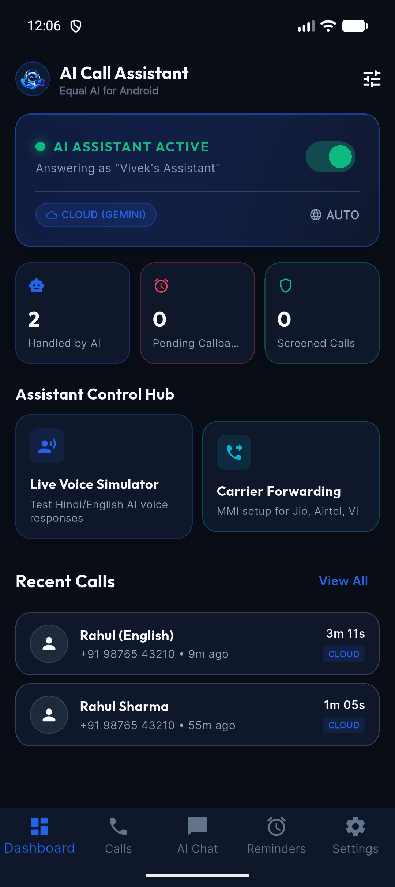
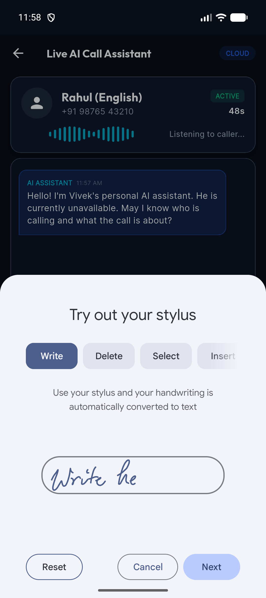
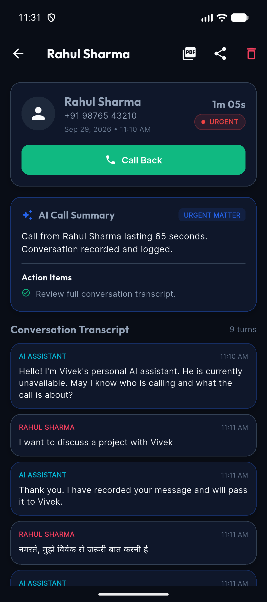
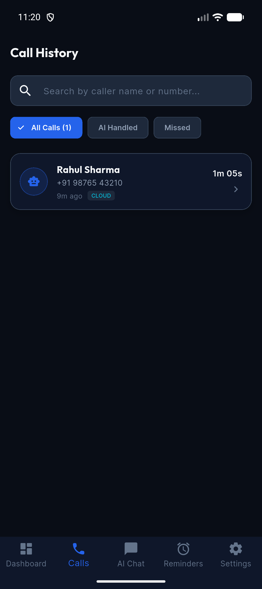
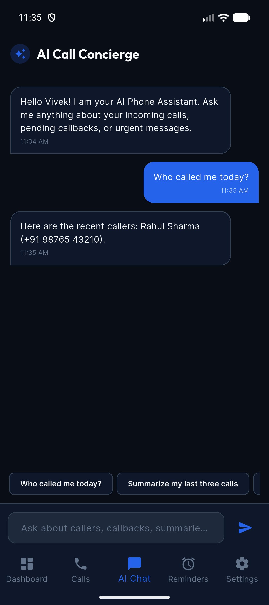
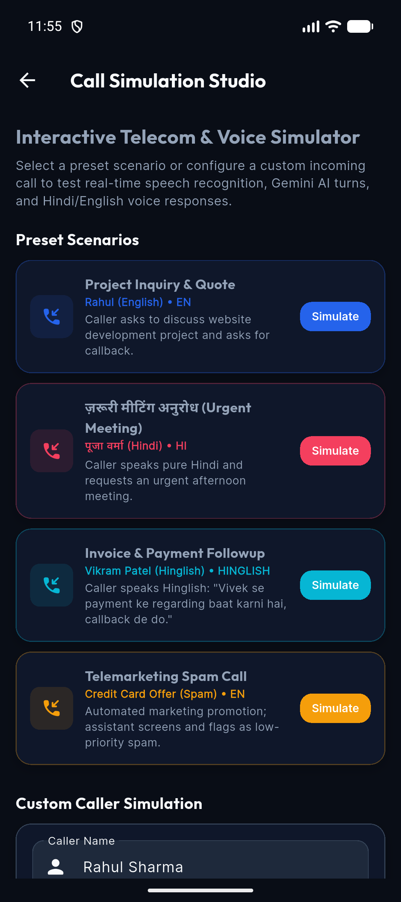
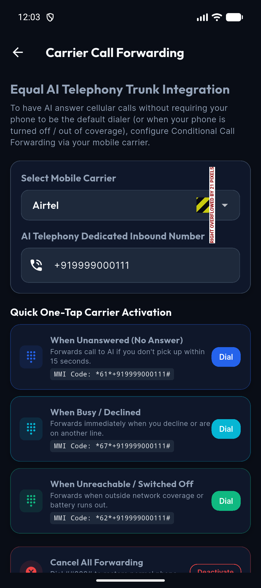
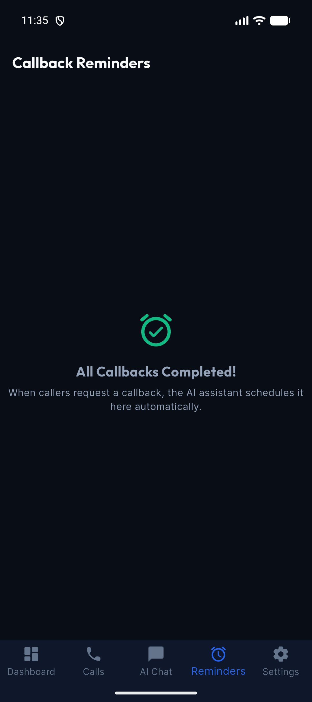
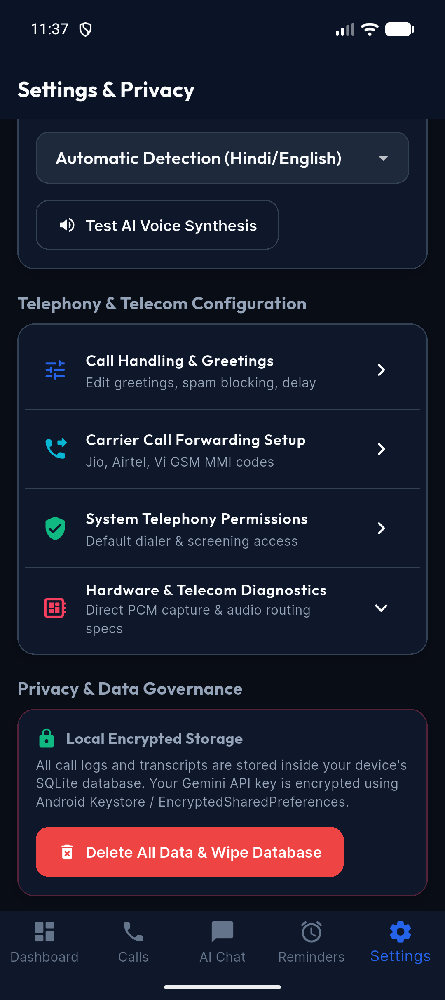

<div align="center">
  
  <h1>AI Call Assistant</h1>
  <p><strong>Next-Gen Personal AI Phone Assistant (Equal AI for Android)</strong></p>
  <p>
    <em>Intelligent Call Answering • Hindi & English Voice • Real-Time Transcription • Gemini AI Summaries • Local & Cloud Modes</em>
  </p>

  [](https://flutter.dev)
  [](https://kotlinlang.org)
  [](https://riverpod.dev)
  [](https://drift.simonbinder.eu)
  [](https://ai.google.dev)
  [](https://android.com)
</div>

---

## 📱 Application Screenshots Showcase

<div align="center">

### 1. Primary Hub & Live Telephony

| **Dashboard Hub** | **Live Call Assistant** | **Call Details & AI Recap** |
|:---:|:---:|:---:|
|  |  |  |
| *Real-time metrics, active AI status toggle & quick actions* | *Live voice waveforms, bilingual speech detection & call controls* | *Key takeaways, sentiment analysis, action items & full transcript* |

<br />

### 2. Intelligence, Logs & Simulation

| **Call History & Records** | **AI Call Concierge** | **Interactive Simulation Studio** |
|:---:|:---:|:---:|
|  |  |  |
| *Category filtering (Incoming, Missed, Blocked) & PDF exports* | *Natural language queries over local SQLite call records* | *End-to-end sandbox testing for Bank, Delivery, Recruiter & Scams* |

<br />

### 3. Telephony Forwarding, Tasks & Privacy

| **Carrier Forwarding Hub** | **Callback Reminders** | **Settings & Voice Engine** |
|:---:|:---:|:---:|
|  |  |  |
| *1-tap MMI setup for Reliance Jio, Airtel, and Vodafone Idea (Vi)* | *Auto-extracted callback scheduling, priority badges & dial action* | *AI voice personalities, Gemini Flash API key & data wipe* |

</div>

---

## 🌟 Key Capabilities

- 🤖 **Equal AI Assistant Experience**: Professional, polite AI greeting that identifies itself as Vivek's assistant, clarifies caller intent, takes messages, and auto-detects callback requests without user impersonation.
- 🇮🇳 **Bilingual Hindi & English Intelligence**: Fully conversational in Hindi, English, and Hinglish with dynamic language auto-detection, localized voice synthesis, and native Devanagari script transcription.
- ⚡ **Real-Time Live Call Screen**: Dynamic voice waveform animation, turn-by-turn conversational display, caller status badges, mute/speaker toggles, and instant end-call controls.
- 🧠 **Dual AI Processing Modes**:
  - **Cloud Mode (Google Gemini Flash)**: Multi-turn reasoning, sentiment analysis, context-aware intent extraction, and automated callback scheduling.
  - **Local Mode (Private & Offline)**: On-device rule classifier ensuring zero conversation telemetry leaves the device.
- 📊 **Drift SQLite Encrypted Database**: Local persistence for `CallRecords`, `TranscriptSegments`, `CallSummaries`, `AssistantSettings`, and `CallbackReminders`.
- 📄 **Executive PDF & Text Export**: 1-tap generation of formal PDF call logs with full timestamps, metadata, and speaker-labeled transcripts.
- 📞 **Carrier Forwarding Hub**: Step-by-step conditional call forwarding (`*67*`, `*61*`, `*62*`) configuration with automatic MMI dialers for Reliance Jio, Airtel, and Vodafone Idea (Vi).

---

## 🏗️ System Architecture

```
┌────────────────────────────────────────────────────────────────────────┐
│                   Flutter Presentation Layer (Material 3)              │
│    Dashboard • Live Call Screen • AI Concierge • Call History • Hub    │
└───────────────────────────────────┬────────────────────────────────────┘
                                    │ State (Riverpod Notifiers & Streams)
┌───────────────────────────────────▼────────────────────────────────────┐
│                    Domain & Business Logic Layer                       │
│    CallSessionController • GeminiAiService • SpeechService • TTS       │
└───────────────────┬────────────────────────────────┬───────────────────┘
                    │                                │
┌───────────────────▼──────────────────┐ ┌───────────▼───────────────────┐
│     Drift SQLite Local Storage       │ │   Android Kotlin Native Layer │
│  Calls • Transcripts • Recap • Alarms│ │  InCallService • CallScreening│
└──────────────────────────────────────┘ └───────────────────────────────┘
```

---

## 🔍 Android Telephony Feasibility & Equal AI Reality

### Why Third-Party Apps Cannot Directly Tap Cellular Audio
On Android 10+ (API 29+), SELinux policies prevent ordinary non-system applications from capturing raw bidirectional cellular PCM audio or injecting synthetic TTS audio into an active baseband cellular call. `MediaRecorder.AudioSource.VOICE_CALL` requires `android.permission.CAPTURE_AUDIO_OUTPUT`, which is restricted to OEM system-signed apps.

### How Production AI Assistants (Equal AI, Truecaller Assistant) Work
1. **Carrier Conditional Call Forwarding**:
   When the user's line is busy, unanswered, or unreachable, the carrier forwards the call via GSM standard MMI codes (`*67*`, `*61*`, `*62*`) to an AI telephony server (SIP/VoIP gateway).
2. **AI Audio Processing**:
   The cloud SIP gateway processes bidirectional audio via Whisper/Speech-to-Text, streams to LLM reasoning, and responds with low-latency TTS.
3. **Real-Time App Sync**:
   The active call session, live transcript, and summary stream into this mobile application in real time via secure WebSockets.

### Native Android Modules Included in this Project
- **`AiInCallService.kt`**: Full Android Telecom `InCallService` integration for default dialer scenarios.
- **`AiCallScreeningService.kt`**: Android `CallScreeningService` for silent background spam evaluation before ringing.
- **`TelecomBridge.kt`**: High-performance `MethodChannel` and `EventChannel` communicating telephony states to Flutter.
- **`CallMonitorService.kt`**: Foreground notification service keeping the assistant active and accessible.
- **`Interactive Simulation Studio`**: End-to-end local test bench allowing full conversational verification with speech recognition and voice synthesis without requiring cellular minutes.

---

## 📁 Project Directory Structure

```text
lib/
├── app/
│   ├── app.dart              # MaterialApp.router configuration & theme bindings
│   ├── providers.dart        # Riverpod Singletons, Notifiers & Stream providers
│   ├── router.dart           # GoRouter route definitions & page transitions
│   └── theme.dart            # Material 3 Deep Navy, Neon Blue & Ruby Red theme
├── core/
│   ├── constants/            # Telecom constants, carrier MMI codes, intent keys
│   ├── database/             # Drift SQLite database schema, DAOs & migrations
│   ├── errors/               # Domain failure & exception definitions
│   ├── services/             # Gemini AI, SpeechToText, TTS, PDF Export, Telecom
│   └── utils/                # Indian phone number formatters & duration helpers
├── features/
│   ├── onboarding/           # Animated splash, onboarding carousel & permissions
│   ├── dashboard/            # Master assistant switch, stats grid, recent calls
│   ├── call_management/      # Live Call Screen, Call Simulator, Carrier Forwarding
│   ├── ai_assistant/         # AI Chat Concierge with natural language SQLite search
│   ├── call_history/         # Searchable call logs, filter chips & PDF export
│   ├── reminders/            # Pending callback reminders management
│   └── settings/             # AI provider, voice/language preferences, database wipe
└── shared/
    └── widgets/              # GlassCard, StatusBadge, WaveAnimation, CustomButton

android/app/src/main/kotlin/in/innovateria/aicallassistant/
├── MainActivity.kt           # Binds TelecomBridge with Flutter engine lifecycle
├── telecom/
│   ├── AiInCallService.kt    # Android InCallService for answering calls
│   ├── AiCallScreeningService.kt # Android CallScreeningService for spam filtering
│   ├── CallStateBroadcaster.kt # Thread-safe EventChannel stream broadcaster
│   └── TelecomBridge.kt      # MethodChannel dispatcher
├── services/
│   └── CallMonitorService.kt # Foreground notification service
├── ai/
│   └── LocalAiEngine.kt      # Offline rule and intent classifier
├── audio/
│   └── AudioRoutingManager.kt # AudioManager audio focus & hardware diagnostics
└── permissions/
    └── PermissionManager.kt  # RoleManager and system dialer permission handlers
```

---

## 🗄️ Database Schema (Drift SQLite)

1. **`CALL_RECORDS`**: `id`, `phoneNumber`, `callerName`, `startTime`, `endTime`, `duration`, `handlingMode`, `language`, `status`.
2. **`TRANSCRIPT_SEGMENTS`**: `id`, `callId`, `speaker` (ai/caller), `textContent`, `timestamp`, `language`.
3. **`CALL_SUMMARIES`**: `id`, `callId`, `summary`, `intent`, `priority` (low/medium/urgent), `callbackRequired`, `callbackTime`.
4. **`ASSISTANT_SETTINGS`**: `id`, `assistantEnabled`, `preferredLanguage`, `aiMode`, `greetingMessage`, `workingHours`.
5. **`CALLBACK_REMINDERS`**: `id`, `callId`, `callerName`, `phoneNumber`, `reminderTime`, `reminderStatus`.

---

## 🚀 Getting Started

### Prerequisites
- **Flutter SDK**: 3.24+ (Tested on Flutter 3.38.1)
- **Java Development Kit**: JDK 17 LTS (e.g. Zulu 17 or OpenJDK 17)
- **Android SDK**: API 34+ (compileSdk 35, minSdk 26)
- **Device / Emulator**: Android 8.0+ device or emulator

### Installation & Run

```bash
# 1. Clone the repository
git clone https://github.com/Vnjvibhash/AI-Call-Assistant.git
cd AI-Call-Assistant

# 2. Configure JDK 17 for Flutter
flutter config --jdk-dir="/Library/Java/JavaVirtualMachines/zulu-17.jdk/Contents/Home"

# 3. Install Flutter dependencies
flutter pub get

# 4. Run code generation for Drift database (already pre-generated)
dart run build_runner build --delete-conflicting-outputs

# 5. Launch on Android device or emulator
flutter run
```

---

## 🔒 Security & Privacy

- **Encrypted Local Storage**: Transcripts and call metadata remain inside your device's private SQLite sandbox.
- **Secure Key Management**: Google Gemini API keys are encrypted via Android Keystore and `EncryptedSharedPreferences`.
- **Zero Cloud Leakage in Local Mode**: When Local Mode is active, conversation turns are processed strictly on-device.
- **1-Tap Wipe**: Settings includes an instant "Delete All Data & Wipe Database" feature with confirmation safeguards.

---

## 📄 License
This project is licensed under the MIT License - see the [LICENSE](LICENSE) file for details.
